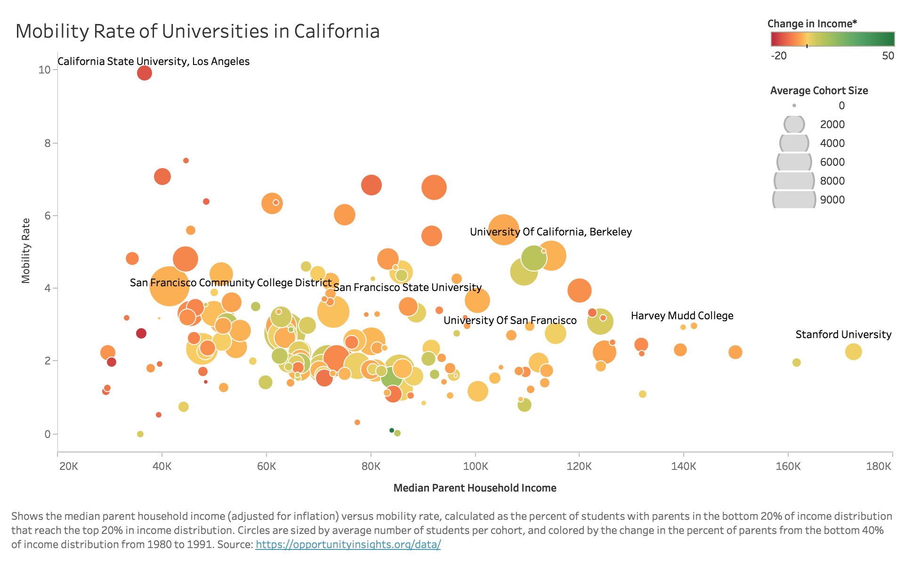
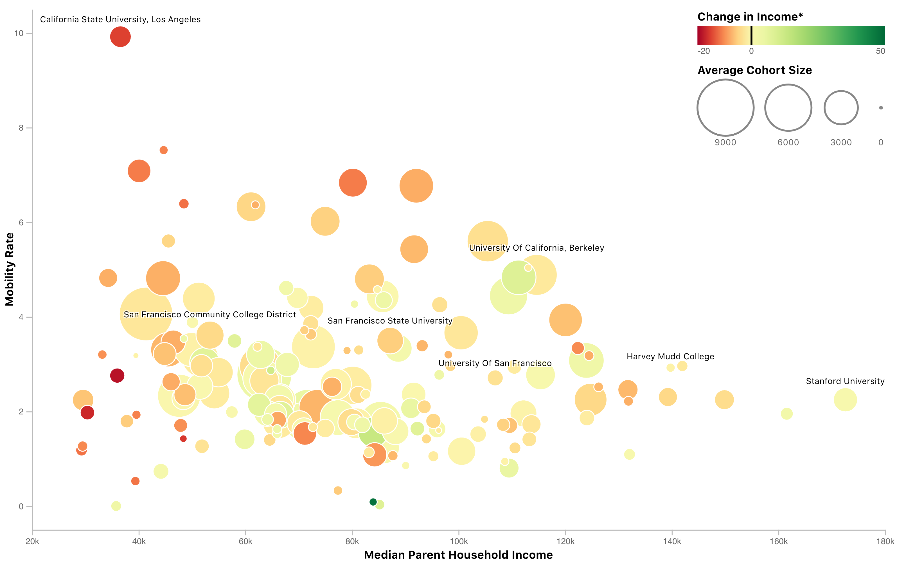

# Mobility Rate by College Bubble Chart

This example will demonstrate how to prototype a bubble chart
in [Tableau Desktop](https://www.tableau.com/products/desktop) and then implement a version of that bubble chart
in [D3.js](https://d3js.org/) version 5.

The data comes from [Opportunity Insights](https://opportunityinsights.org/data/), which is a "non-partisan,
not-for-profit organization based at Harvard University" that puts out public datasets produced for on their research.

We will specifically use data from
the [Mobility Report Cards](https://opportunityinsights.org/paper/mobilityreportcards/) project. The dataset is titled "
Mobility Report Cards: Preferred Estimates of Access and Mobility Rates by College" and can be accessed via these direct
links:

[mrc_table1.csv](https://opportunityinsights.org/wp-content/uploads/2018/03/mrc_table1.csv)  
[Codebook-MRC-Table-1.pdf](https://opportunityinsights.org/wp-content/uploads/2018/03/Codebook-MRC-Table-1.pdf)

The original CSV file is [replicated on this gist](#file-mrc_table1-csv) to avoid CORS issues when viewing this example
on [bl.ocks.org](https://bl.ocks.org/sjengle/0f3caca5c7329733cb8ed912d84807ed)
or [blockbuilder.org](https://blockbuilder.org/sjengle/0f3caca5c7329733cb8ed912d84807ed).

We will filter this data to focus only on those universities located in California, which includes
the [University of San Francisco](https://www.usfca.edu/).

## Tableau Prototype

See the [`bubble_prototype.twbx`](bubble_prototype.twbx) workbook for how to create this prototype. It is important to
make sure count appears first on the marks card, which makes sure the smaller bubbles are drawn on top of the larger
ones.

Below is the sheet description from Tableau to help rebuild it:

#### Description of "Bubble Chart"

`Par Median` vs. `Mr Kq5 Pq1`. Color shows details about `Trend Bottom40`. Size shows details about `Count`. The marks
are labeled by `Name`. The data is filtered on `State`, which keeps CA.

#### Marks

The mark type is Circle.  
The marks are labeled by `Name`.  
Stacked marks is off.

#### Shelves

Label | Field
------|-------
Rows: | `Mr Kq5 Pq1`
Columns: | `Par Median`
Filters: | `State`
Text: | `Name`
Color: | `Trend Bottom40`
Size: | `Count`

#### Dimensions

- `Count` ranges from 50 to 8556 on this sheet.
- `Mr Kq5 Pq1` ranges from 0.000 to 9.918 on this sheet.
- `Name` has 168 members on this sheet...
- `Par Median` ranges from 29300 to 172600 on this sheet.
    - Members: California Institute Of Technology; Loyola Marymount University; Mt. San Jacinto College; Pasadena City
      College; San Joaquin Valley College; ...
- `State` has 1 members on this sheet
    - Members: CA
- `Trend Bottom40` ranges from -18 to 48 on this sheet.

## D3 Implementation

See the [index.html](index.html), [style.css](style.css), and [bubble.js](bubble.js) files for the D3 implementation.

This implementation makes use of the [d3-legend](https://d3-legend.susielu.com/) library.
